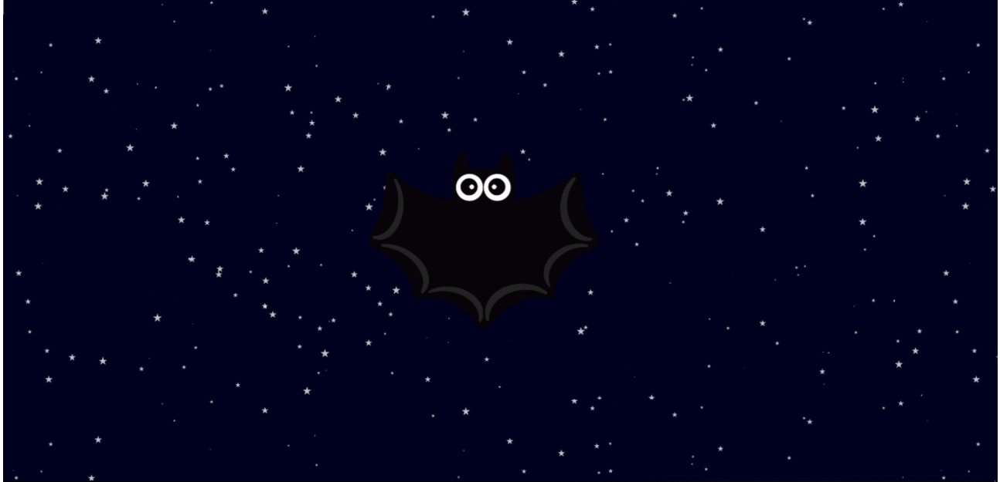

# ambient-light-events

Hello hello!

This is a simple project that I decided to do using a device light api (https://developer.mozilla.org/en-US/docs/Web/API/DeviceLightEvent/Using_light_sensors).

Note: this project will only run on Mozilla Firefox and devices with light sensors.